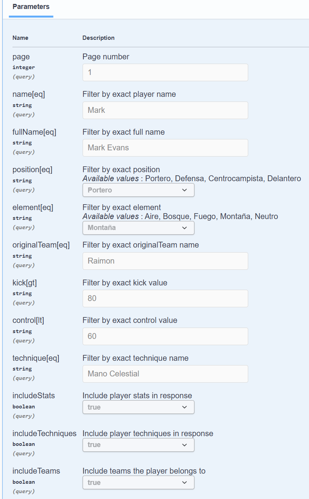
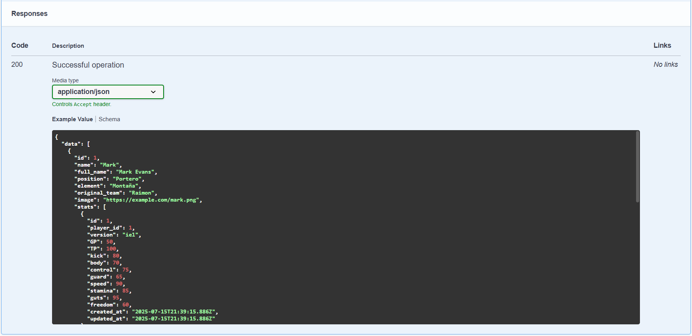

## Table of Contents
1. [Overview](#overview)
2. [Features](#features)
3. [Authentication](#authentication)
4. [Endpoints](#endpoints)
5. [Filters](#filters)
6. [Responses](#responses)
6. [Schemas Examples](#schemas-examples)

---

## Overview
**Inazuma REST API** is an API for creating gathering information about Coach, Emblem, Formation, Player, Stat, Techniques, Teams... of the original saga.

---

## Features ✨
- Sanctum Authentication with Admin / User / Guest
- CRUD Operations for Coach, Emblem, Formation, Player, Stat, Techniques, Teams...
- Advanced Filtering for Entity Properties and Relationships
- Paginated Responses
- Swagger UI Documentation

---

## Authentication 🔑
- Endpoints
- Everyone can acces to index/show
- Users can acces the CRUD for their own Teams
- Admin can access everything

---

## Endpoints 🌐

Endpoints Examples

---

## Filters 🔎

Filters Examples

---

## Responses 📤 

Responses Examples

---

## Schemas Examples 📝 

Schemas Examples

---