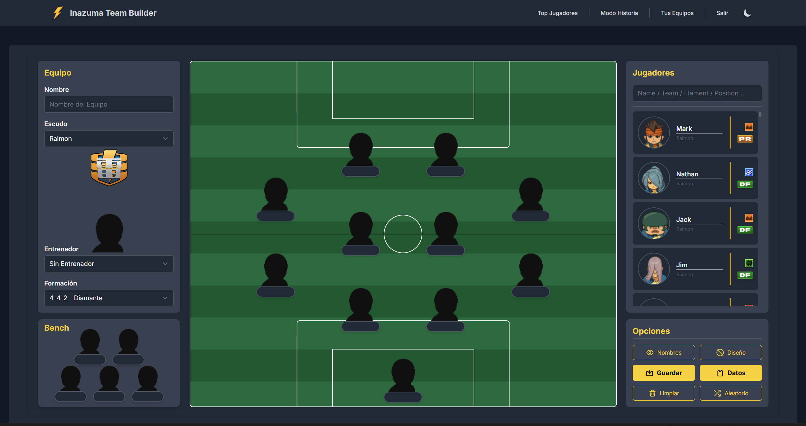

## Table of Contents
1. [Overview](#overview)
2. [Features](#features)
3. [Story Mode](#story-mode)
4. [Top Players](#top-players)
5. [Save and Team Data](#save-and-team-data)

---

## Overview
**Inazuma Team Builder** is a web tool for creating your Inazuma Eleven teams, including all the players from the original saga (3 seasons and 3 games).

---

## Features ✨
-   🔍 Search for your favorite players by name, team, element, position, etc...
-   🧩 Use Drag & Drop to place them in the field or swap positions between players.
-   ⚙️ Customize your team by changing the emblem, coach, and formation.

---

## Story Mode 📖

You can use the top menu to browse all the original teams and view their details.

---

## Top Player 🏆

When logged in, you can use the Top Players search to filter by game, position, element, and view a list ordered by stats.

---

## Save and Team Data 💾

While logged in, you can save your teams and access a page where you can see all the players of a team with their techniques and stats for each season and game.

---