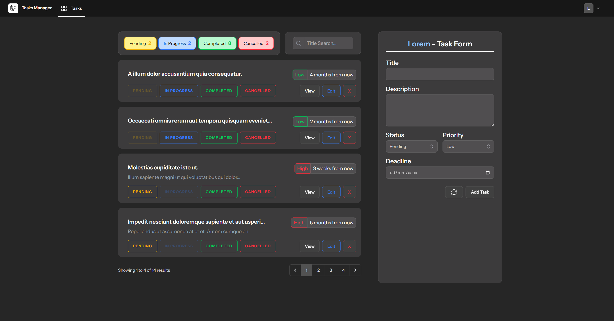
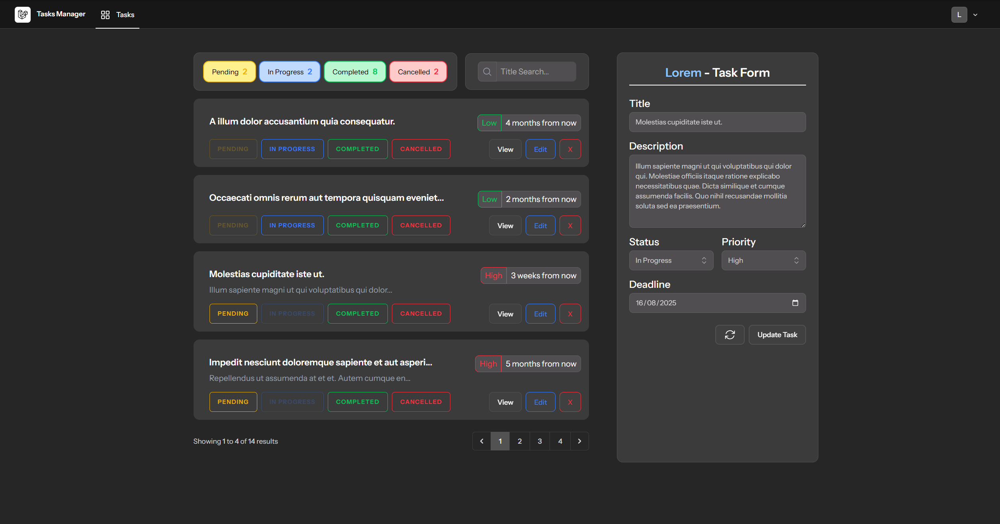
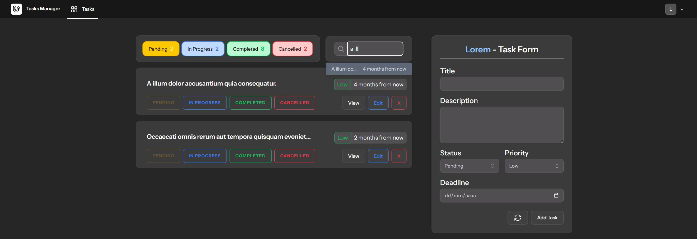
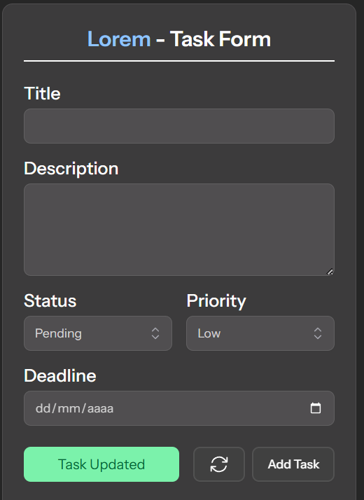
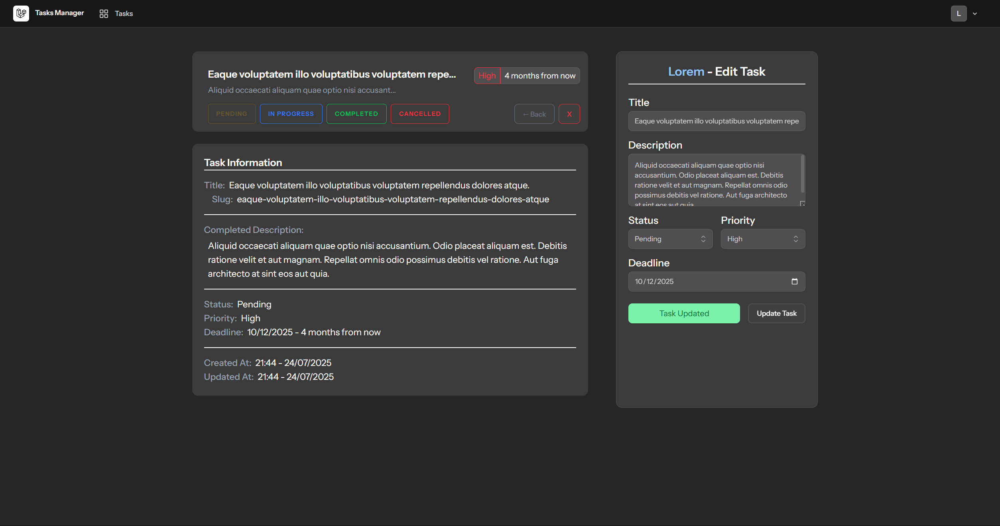

## Table of Contents
1. [Overview](#overview)
2. [Main Page](#main-page)
3. [Show Page](#show-page)

---

## Overview
This is a web app for managing tasks using Livewire.  
The views are divided into reusable components, and the pages work with Livewire to avoid reloading.

You can register / log in to view your tasks.  
A registered user can create, edit, delete, etc...

---

## Main Page

The main page has 2 columns:
- List of the User's Tasks with filters
- Form to create and edit

In the list, the main data is shown. The titles are links using **Slug**, and the **Status** buttons are interactive to quickly change the **Status** of each task.

  

The **View** button shows the Task in full size with all the data without any truncation. The **Delete** button asks for confirmation before deleting.  
The **Edit** button changes and fills the form to quickly edit the task.

  

The upper counters work as interactive buttons to **Filter by Status**.  
The **Search Widget** shows a filtered list with Title and Deadline, allowing the user to open the selected Task.

  

When creating/editing/deleting, a **Flash Message** is shown next to the Form.

 

---

## Show Page

When viewing a Task in full, the same **Task Card** is shown above the full details without truncation.  
Additionally, the Form is reused, changing the necessary values so that it only serves for editing.  
The Status and Delete buttons continue to work, and a new Back button appears.

---